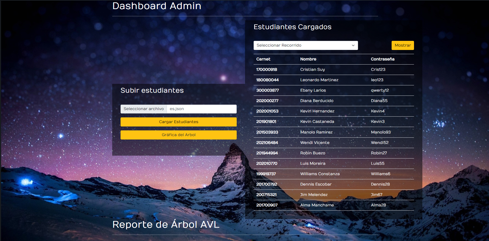
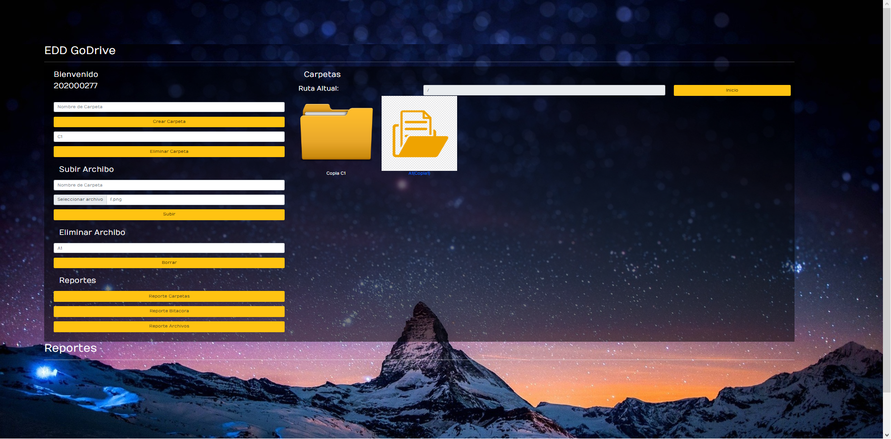

# Manual Técnico 

Universidad de San Carlos de Guatemala 

Facultad de Ingeniería

Escuela de Ciencias y Sistemas

ESTRUCTURA DE DATOS 1

Primer Semestre 2023

Ing. Alvaro Hernandez

Tutor Académico: Leonardo Martinez

Sección: A 

[1]: LGUSF.png

Erick Enrique González Chávez 201900621

## Manual
### Pantalla de login.

En esta pantalla se ingresan las credenciales necesarias.

### Pantalla de Administrador.

En esta pantalla se ingresan los estudiantes.

Al seleccionar la opcion de seleccionar archivo se tiene la opcion de seleccionar los archivos que se desean cargar.

Al seleccionar la opcion de cargar estudiantes se cargara el archivo con los estudiantes.

Al seleccionar la grafica del arbol se cargara una imagen de la grafica con los estudiantes ordenador por carnet.

Al seleccionar la lista de opciones se tendra las diferentes opciones para ver la lista de estudiantes.

### Pantalla Principal.

En esta pantalla se ingresan los estudiantes.

Al ingresar un nombre y hacer click en crear carpeta se creara una carpeta.

Al ingresar un nombre que ya este usado y hacer click en crear carpeta se creara una carpeta con un nombre distinto agregando Copia al inicio.

Al ingresar un nombre y hacer click en Eliminar Carpeta se eliminara una carpeta.

Al ingresar al hacer click una carpeta se ingresara en la carpeta.

Al ingresar al hacer click en el boton inicio regresara a la carpeta raiz.

Al hacer click la opcion seleccionar archivo se abrira una opcion para seleccionar el archivo a subir.

Al hacer click la opcion subir y tener o no un nombre se subira el archivo.

Al hacer click la opcion subir y tener un nombre repetido se subira el archivo con un nombre distinto.

Al hacer click la opcion eliminar y nombre se eliminara el archivo.

Al hacer click la opcion de reporte de carpetas se deplegara una imagen de las carpetas.

Al hacer click la opcion de reporte de bitacora se deplegara una imagen de la bitacora.

Al hacer click la opcion de reporte de archivos se deplegara una imagen de archivos.

Al hacer click en los archivos se descargara el archivo.

