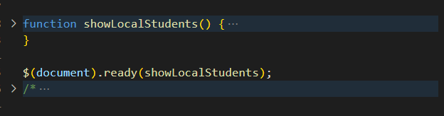
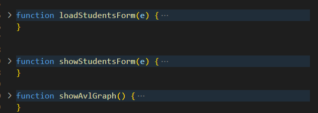
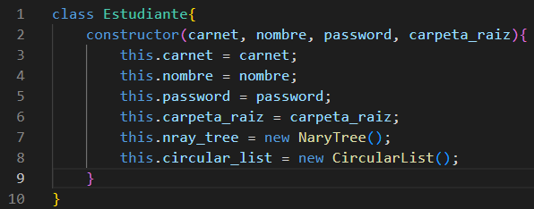
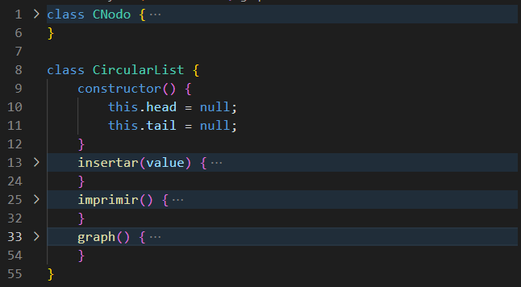
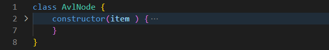
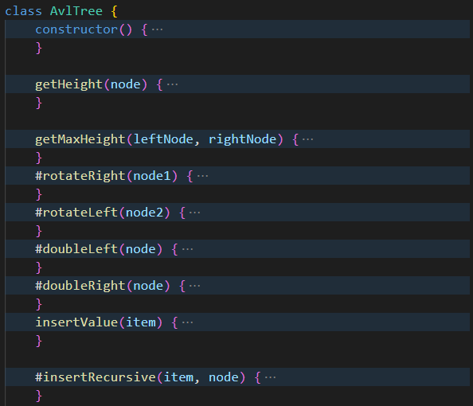
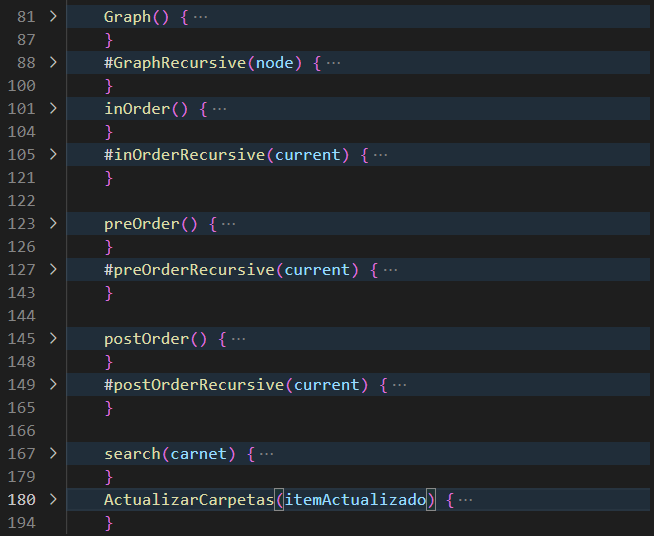
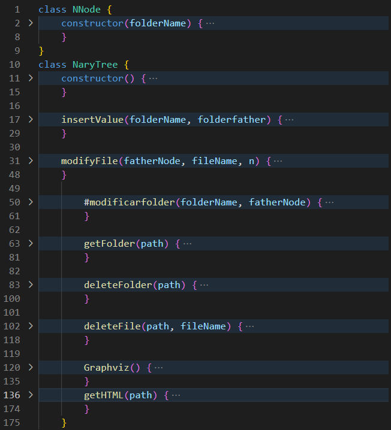
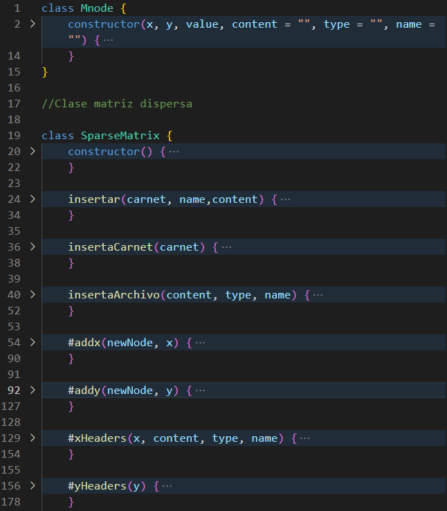
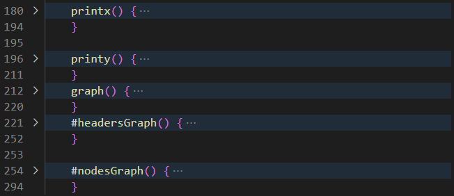

# Manual Técnico 

Universidad de San Carlos de Guatemala 

Facultad de Ingeniería

Escuela de Ciencias y Sistemas

ESTRUCTURA DE DATOS 1

Primer Semestre 2023

Ing. Alvaro Hernandez

Tutor Académico: Leonardo Martinez

Sección: A 

[1]: LGUSF.png

Erick Enrique González Chávez 201900621

# Manual

## HTML

### Pantalla de login.

Codigo de html de login.

### Pantalla de administrador.

Codigo de html de administrador.

### Pantalla de principal.

Codigo de html de principal.

Codigo para botones.

Codigo para Reportes.

## JavaScript

Codigo para el login.

Codigo para el manejo de carpetas.

Codigo para el manejo de reportes.

Codigo para el manejo de archivos.

Codigo para mostrar el carnet del estudiante actual.

Codigo para el manejo del administrador.

Codigo para la clase estudiante.

Codigo para la clase lista circular.

Codigo para la clase nodo del arbol avl.

Codigo para la ingresar nodos al arbol avl.

Codigo para el manejo de la representacion del arbol avl.

Codigo para el manejo la estructura del arbol n-rio con la insercion, cambio de nombres de archivos y carpetas y representacion grafica.

Codigo para el manejo la estructura de la matriz dispersa y ingresar datos.

Codigo para la representacion de la matriz dipersa.

