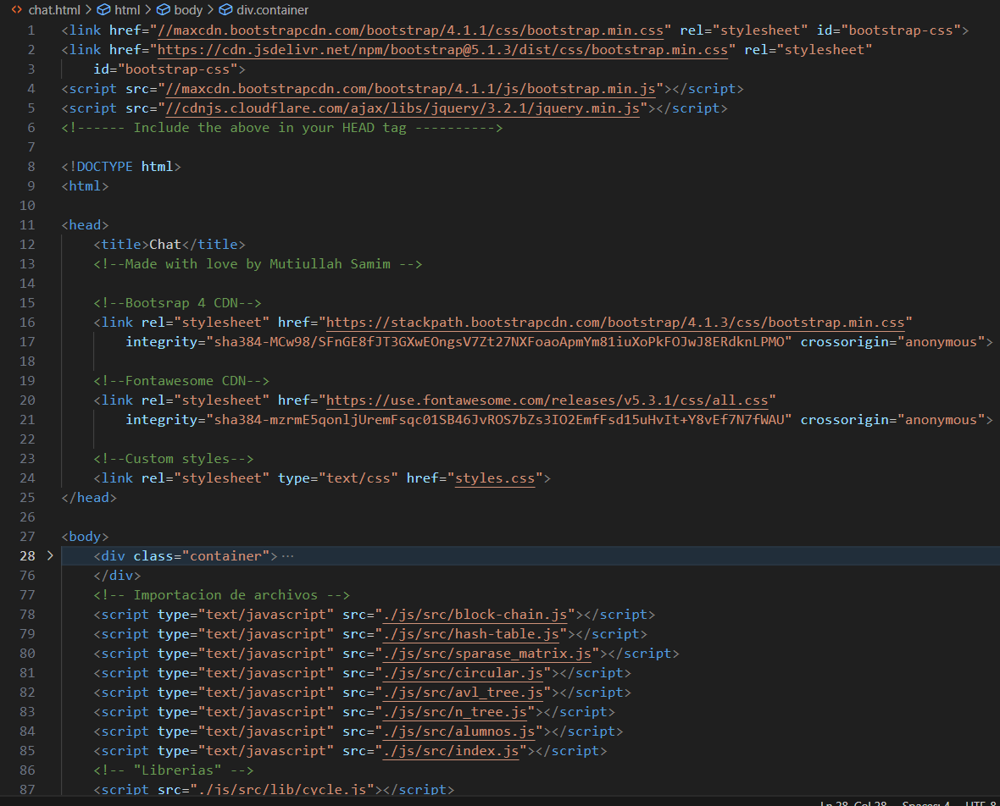
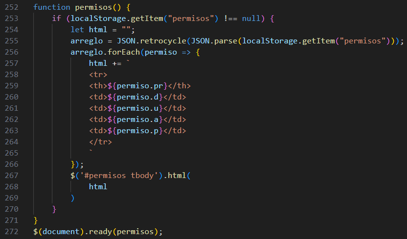

# Manual Técnico 

Universidad de San Carlos de Guatemala 

Facultad de Ingeniería

Escuela de Ciencias y Sistemas

ESTRUCTURA DE DATOS 1

Primer Semestre 2023

Ing. Alvaro Hernandez

Tutor Académico: Leonardo Martinez

Sección: A 

[1]: LGUSF.png

Erick Enrique González Chávez 201900621

# Manual

## HTML

### Pantalla de chat.

Codigo de javascript y html del chat.

Codigo de block chain.

### Tablahash.

Codigo de la carga de tabla hash.

Codigo de la estructura de tabla hash.

### Grafo 

Codigo del grafo.

### Codigo de permisos

Codigo de permisos.

