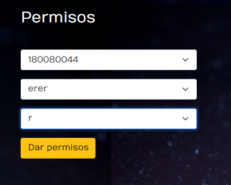

# Manual Técnico 

Universidad de San Carlos de Guatemala 

Facultad de Ingeniería

Escuela de Ciencias y Sistemas

ESTRUCTURA DE DATOS 1

Primer Semestre 2023

Ing. Alvaro Hernandez

Tutor Académico: Leonardo Martinez

Sección: A 

[1]: LGUSF.png

Erick Enrique González Chávez 201900621

## Manual
### Permisos.

En esta pantalla se ingresan los permisos seleccionan el carnet, archivo y tipo de permiso.

### Chat.

Boton de ingreso al chat.

Pagina de chat.

### Administrador.

Reportes html.

Reportes Graphviz.

